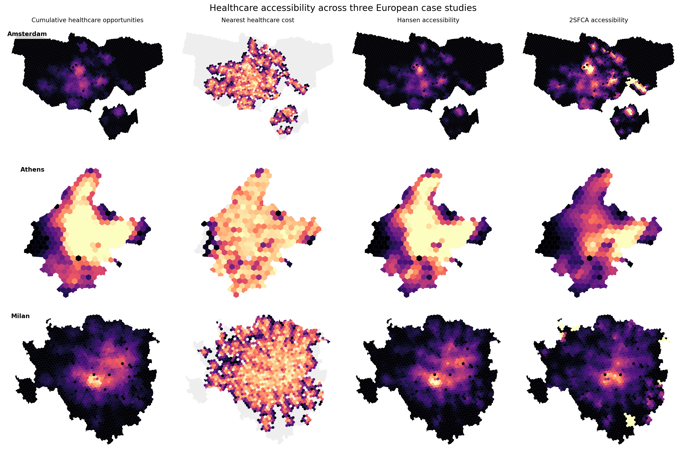
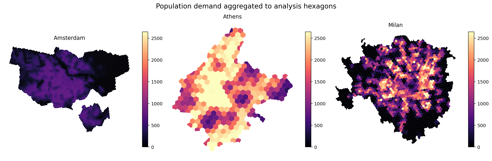
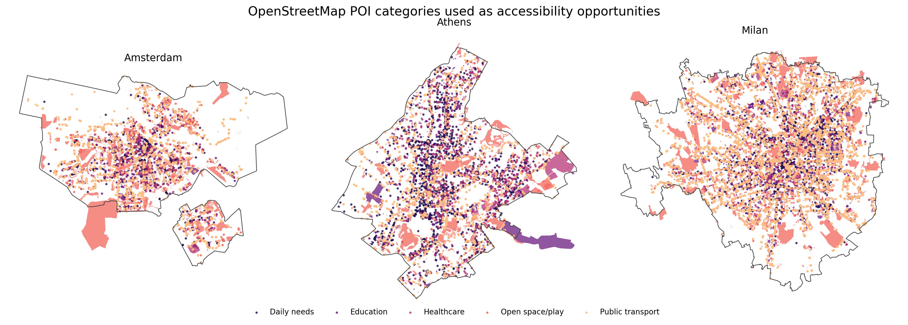
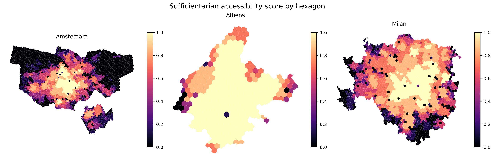
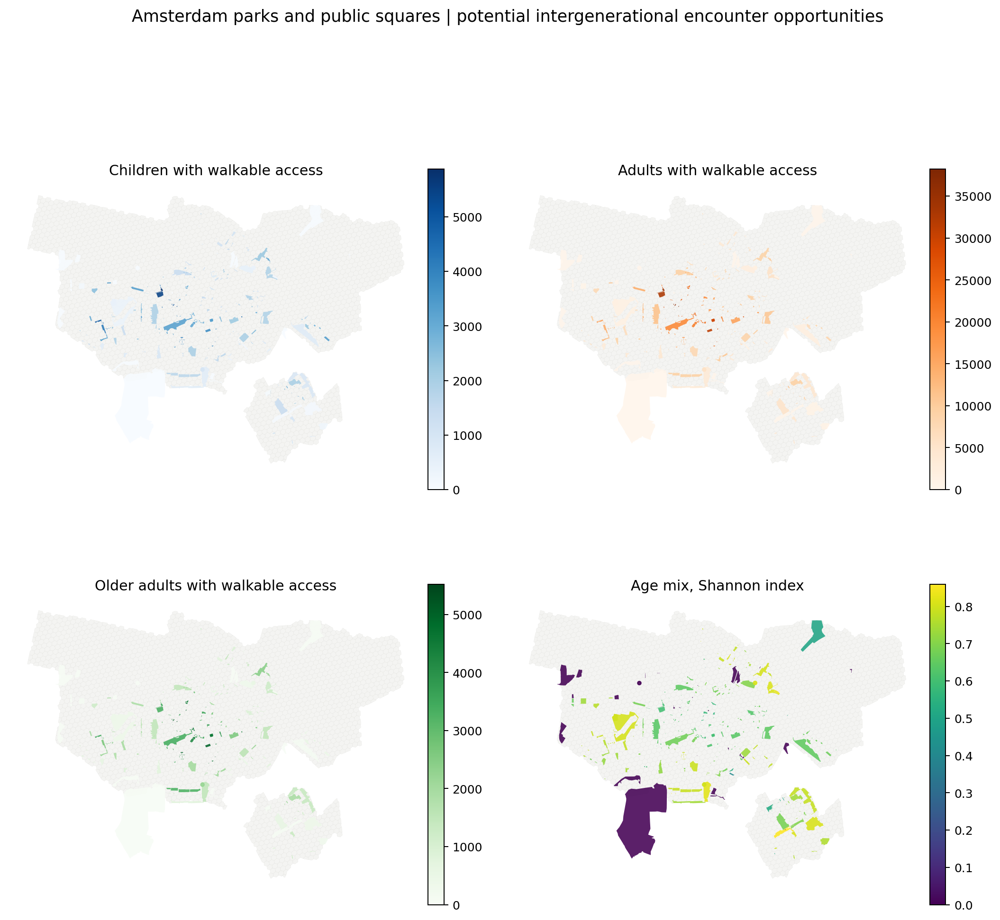

# accessX

**Network-based accessibility analysis for X-minute cities, proximity planning, and urban opportunity mapping.**

`accessX` is a Python library for studying what people can reach, how easily they can reach it, and how accessibility is distributed across places and populations.

The **X** can represent any network cost threshold: walking minutes, cycling time, distance, generalized cost, or a custom edge-weight measure.

Built on GeoPandas, OSMnx, NetworkX, H3, and rasterio, accessX provides a focused API for reproducible accessibility workflows without hiding the underlying geospatial data.



## Design Principles

- **Plug-n-play, without locking you in:** accessX provides ready-to-use methods for common accessibility workflows while keeping the underlying GeoDataFrames and OSMnx graphs available for customization.
- **Use the data you have:** work with OSM POIs and WorldPop data, or provide your own destinations, capacities, population grids, demographic groups, and demand measures.
- **Define accessibility through the cost that matters:** estimate walking accessibility with a standard average speed, use slope-sensitive travel time, or assign your own edge cost to an OSMnx graph for factors such as comfort, safety, effort, distance, or a generalized impedance.
- **Network-based by default:** accessibility is calculated over the street graph rather than straight-line distance.
- **Transparent and composable:** modules can be used independently, outputs remain reusable GeoDataFrames, and intermediate layers can be saved, inspected, and replaced.
- **Built for reproducible long-running analysis:** retries, progress bars, clear errors, and graph/data persistence support workflows that can be rerun and audited.

## What Can You Study?

- How many services are reachable within 5, 10, or 15 minutes?
- What is the network travel cost to the nearest healthcare facility or park?
- How does accessibility change when nearby opportunities are weighted more strongly?
- Where is service supply high or low relative to population demand?
- How many people can access the same POI?
- How evenly is accessibility distributed across neighborhoods or population groups?

## Workflow

```text
Area of interest
    -> H3 hex grid
    -> walking or cycling network
    -> edge travel costs
    -> OSM POIs and population demand
    -> accessibility scores
    -> co-accessibility and equity analysis
```

Isochrones are available as an optional communication and visualization layer.

## Case Study Gallery

The case-study notebooks save their intermediate and final GeoDataFrames, so figures can be regenerated from existing outputs without rerunning network routing or data downloads.



*Population demand is allocated to H3 hexagons and used as the demand surface for supply-demand accessibility models such as 2SFCA.*



*OpenStreetMap features are grouped into analytical opportunity categories while preserving their original OSM tags and identifiers.*



*Equity workflows can summarize whether each origin satisfies a basket of minimum accessibility thresholds.*



*Co-accessibility identifies parks and public squares where children, adults, and older adults have walkable access, using Shannon diversity to highlight stronger potential intergenerational encounter opportunities.*

## Relevant Research

The methods in `accessX` are connected to the following research and tools. Some works used related computational code, while others provide the conceptual or methodological basis for the library.

### Co-Accessibility

- Milias, V., & Psyllidis, A. (2022). Measuring spatial age segregation through the lens of co-accessibility to urban activities. *Computers, Environment and Urban Systems, 95*, 101829. https://doi.org/10.1016/j.compenvurbsys.2022.101829
- Milias, V., Psyllidis, A., & Bozzon, A. (2024). Bridging or separating? Co-accessibility as a measure of potential place-based encounters. *Journal of Transport Geography, 121*, 104027. https://doi.org/10.1016/j.jtrangeo.2024.104027
- Milias, V. (n.d.). *CTwalkMap* [Web mapping tool]. https://miliasv.github.io/CTwalkMap/?city=amsterdam

### Equity

- Milias, V., Tsigdinos, S., Tzouras, P. G., & Kepaptsoglou, K. (2025). Assessing equitable access in X-minute cities through open spatial data. *Environment and Planning B: Urban Analytics and City Science*. Advance online publication. https://doi.org/10.1177/23998083251398660
- Milias, V. (n.d.). *CThood* [Web mapping tool]. https://miliasv.github.io/CThood/?city=athens#11.95/38.00354/23.76933

### Accessibility Models

- Hansen, W. G. (1959). How accessibility shapes land use. *Journal of the American Institute of Planners, 25*(2), 73–76.
- Luo, W., & Wang, F. (2003). Measures of spatial accessibility to health care in a GIS environment: Synthesis and a case study in the Chicago region. *Environment and Planning B: Planning and Design, 30*(6), 865–884.

### Broader Concepts

- Moreno, C., Allam, Z., Chabaud, D., Gall, C., & Pratlong, F. (2021). Introducing the “15-Minute City”: Sustainability, resilience and place identity in future post-pandemic cities. *Smart Cities, 4*(1), 93–111. https://doi.org/10.3390/smartcities4010006
- Handy, S. (2020). Is accessibility an idea whose time has finally come? *Transportation Research Part D: Transport and Environment, 83*, 102319. https://doi.org/10.1016/j.trd.2020.102319

## Installation

```bash
pip install accessx
```

Python 3.10 or newer is required.

For local development:

```bash
pip install -e .
```

## Quick Start

```python
import accessx as acx
import osmnx as ox

# 1. Area of interest and origins
aoi = ox.geocode_to_gdf("Municipality of Athens, Greece")
hexes = acx.make_hex_grid(aoi, resolution=9)

# 2. Walking network and travel-time cost
graph = acx.build_network(
    aoi,
    city_epsg=2100,
    buffer_m=1000,
    network_type="walk",
    show_progress=True,
)
graph = acx.add_time_cost_constant_speed(
    graph,
    speed_kmh=4.5,
    cost_col="walk_time",
    show_progress=True,
)

# 3. POIs with custom analytical categories backed by explicit OSM tags
pois = acx.get_pois_osm(
    aoi,
    poi_groups={
        "healthcare": {
            "amenity": ["pharmacy", "clinic", "doctors"],
        },
        "open_space": {
            "leisure": ["park", "playground", "garden"],
        },
    },
    show_progress=True,
)

# 4. Cumulative opportunities within 15 walking minutes
counts = acx.count_accessible_pois(
    graph,
    hexes.to_crs(2100),
    pois.to_crs(2100),
    max_cost=15,
    cost_attr="walk_time",
    show_progress=True,
)
```

## Accessibility Models

| Model | Function | Question Answered | Main Inputs |
| --- | --- | --- | --- |
| Cumulative opportunity measure | `count_accessible_pois` | How many opportunities can each origin reach within X cost? | Hexes, POIs, graph |
| Nearest POI cost | `compute_nearest_poi_cost` | How far is the nearest reachable POI in each category? | Hexes, POIs, graph |
| Hansen accessibility | `compute_hansen_accessibility` | How much opportunity is available when nearby POIs contribute more? | Hexes, weighted POIs, graph |
| 2SFCA / E2SFCA-like accessibility | `compute_2sfca_accessibility` | How strong is service supply relative to accessible population demand? | Hex demand, POI supply, graph |
| Co-accessibility | `compute_co_accessibility` | How many people can access each POI? | Population hexes, POIs, graph |

All routing models support custom edge cost attributes and optional progress bars for long calculations.

## POIs: Direct OSM Tags or Custom Groups

accessX queries explicit OSM tags. You can use OSM keys directly:

```python
pois = acx.get_pois_osm(
    aoi,
    osm_tags={
        "amenity": ["pharmacy", "clinic"],
        "leisure": ["park", "playground"],
        "healthcare": True,
    },
)
```

Or define categories that are meaningful for your analysis:

```python
pois = acx.get_pois_osm(
    aoi,
    poi_groups={
        "daily_needs": {
            "shop": ["supermarket", "convenience", "bakery"],
            "amenity": ["marketplace", "post_office"],
        },
        "public_transport": {
            "highway": ["bus_stop"],
            "railway": ["station", "tram_stop", "subway_entrance"],
        },
    },
)
```

The POI output preserves:

- `category`: your custom group, or the OSM key in direct tag mode
- `subcategory`: the matched OSM value
- `osm_key` and `osm_value`: the original OSM tag
- `osm_type` and `osmid`: the original OSM feature identity

POI queries retry transient OSM/Overpass failures and raise a clear `POIQueryError` rather than silently returning incomplete results.

## Population and Demand

accessX can download and clip WorldPop rasters, convert rasters to vector population grids, and aggregate population to H3 hexagons.

```python
raster_path = acx.get_worldpop_raster(
    aoi=aoi,
    year=2020,
    clip=True,
    save_path="worldpop_athens_2020.tif",
    show_progress=True,
)

hexes_with_population = acx.map_population_to_hexes(
    hexes,
    raster_path,
    metric_crs=2100,
)
```

Area-weighted overlap is used so population cells are split proportionally across intersecting hexagons. Custom population grids and multiple population-group columns are also supported.

## Modules

### `accessx.aoi`

Prepare analysis areas and spatial origins.

- `load_aoi`: load an AOI from a vector file or bounding box, optionally buffer and dissolve it
- `make_hex_grid`: create an H3 hex grid over an AOI

### `accessx.graph`

Build and persist OSM street networks.

- `build_network`: download, clean, and project a walking, cycling, or other OSMnx network
- `save_graph`: save graph nodes and edges
- `load_graph`: rebuild a graph from saved node and edge files

### `accessx.cost`

Define the travel cost used by network routing.

- `add_time_cost_constant_speed`: add travel time using a constant speed
- `add_slope_based_time`: create a Tobler hiking-time cost function
- `add_edge_cost`: add any custom numeric edge cost

For example, the same accessibility functions can route over walking minutes or a custom comfort-related edge impedance:

```python
graph = acx.add_time_cost_constant_speed(
    graph,
    speed_kmh=4.5,
    cost_col="walk_time",
)

def comfort_cost(edge):
    return edge["length"] * edge.get("comfort_penalty", 1.0)

graph = acx.add_edge_cost(
    graph,
    cost_fn=comfort_cost,
    cost_col="comfort_cost",
)

# Choose the cost definition at analysis time.
counts = acx.count_accessible_pois(
    graph,
    hexes,
    pois,
    max_cost=1500,
    cost_attr="comfort_cost",
)
```

### `accessx.poi`

Collect and organize destinations from OpenStreetMap.

- `get_pois_osm`: query explicit OSM tags or custom POI groups, with retries, reports, and progress
- `POIQueryError`: raised when one or more OSM queries fail after retries

### `accessx.population`

Prepare population demand data.

- `infer_country_from_geometry`: identify the country intersecting an AOI or hex grid
- `get_worldpop_raster`: download and optionally clip a WorldPop raster
- `raster_to_population_grid`: convert raster cells into a vector population grid
- `map_population_to_hexes`: aggregate raster population to hexes
- `map_population_grid_to_hexes`: aggregate one or more population columns from a vector grid

### `accessx.accessibility`

Calculate origin-based and destination-based accessibility.

- `count_accessible_pois`: cumulative opportunity measure by category
- `compute_nearest_poi_cost`: nearest POI costs in list, long, or wide output formats
- `compute_hansen_accessibility`: distance-decayed opportunity accessibility
- `compute_2sfca_accessibility`: supply-demand catchment accessibility with binary or exponential decay
- `compute_co_accessibility`: accessible population around each POI, using cumulative or Hansen-style decay

### `accessx.isochrone`

Create walksheds and isochrone geometries.

- `calculate_isochrones`: generate one or more cost-threshold polygons per origin
- Supports `edges` and `hull` polygon methods, serial or parallel execution, progress bars, and optional CSV export

### `accessx.equity`

Assess how accessibility is distributed.

- `calculate_lorenz`: calculate Lorenz curves and Gini indices
- `plot_lorenz_curves`: visualize accessibility distributions
- `compute_sufficientarian_score`: score whether explicit accessibility thresholds are met
- `plot_sufficientarian_score`: visualize score distributions and attainment levels

### `accessx.io`

Read and write GeoDataFrames.

- `read_gdf`
- `save_gdf`

## Case Studies

The notebooks provide focused, reproducible examples:

- [`case_study_isochrones.ipynb`](notebooks/case_study_isochrones.ipynb): AOIs, hex grids, street networks, costs, and isochrones
- [`case_study_population.ipynb`](notebooks/case_study_population.ipynb): WorldPop and population-to-hex workflows
- [`case_study_pois.ipynb`](notebooks/case_study_pois.ipynb): OSM tags, custom POI groups, retries, and query reports
- [`case_study_accessibility.ipynb`](notebooks/case_study_accessibility.ipynb): cumulative opportunities, nearest POIs, Hansen accessibility, and 2SFCA
- [`case_study_co_accessibility.ipynb`](notebooks/case_study_co_accessibility.ipynb): population access around POIs
- [`case_study_equity.ipynb`](notebooks/case_study_equity.ipynb): territorial and population-based accessibility equity

## License

accessX is released under the MIT License.
